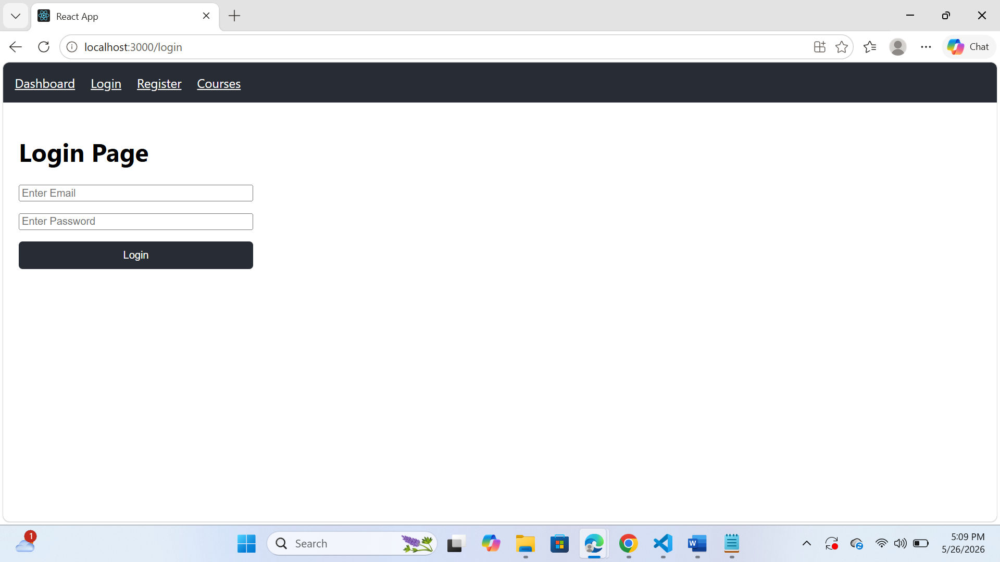
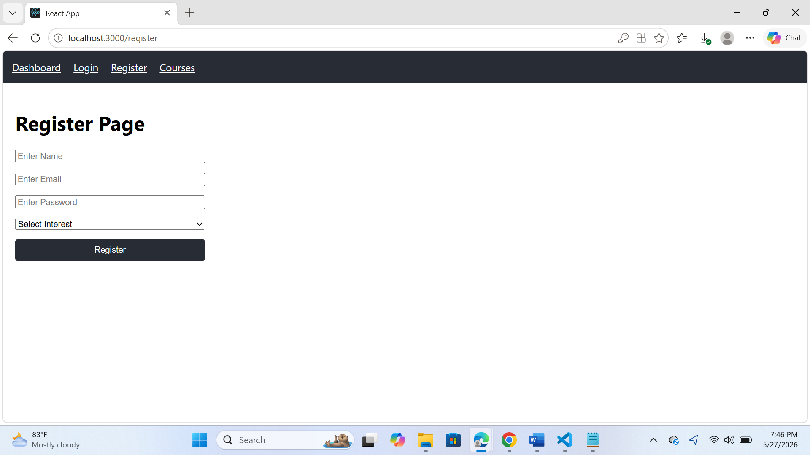
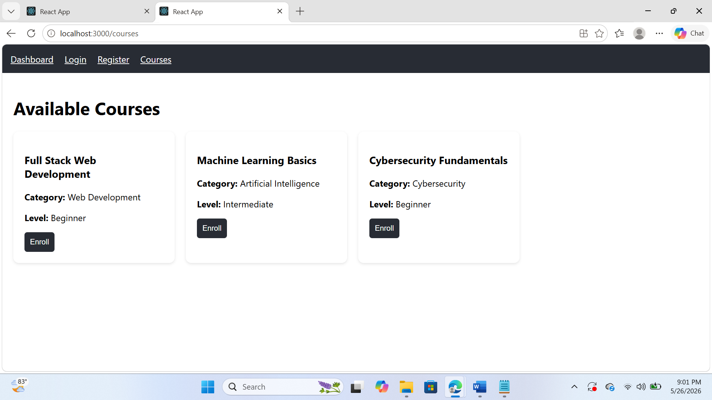
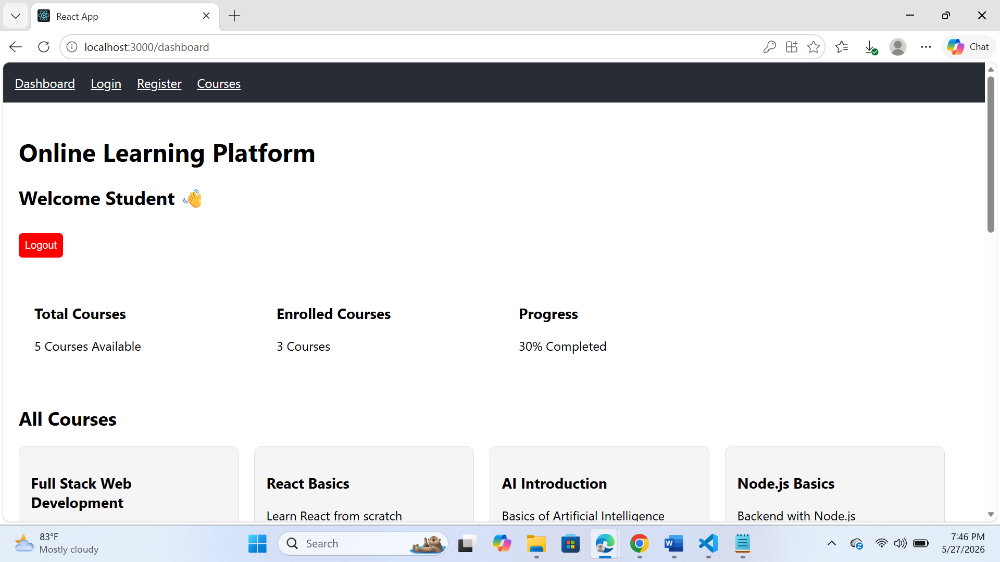

# 🎓 Online Learning Platform

A full-stack MERN Online Learning Platform with authentication, personalized course recommendations, enrollment tracking, and progress monitoring.

---

# 🚀 Features

* 🔐 User Authentication (JWT)
* 🛡️ Protected Routes
* 📚 Course Enrollment
* 🎯 Personalized Course Recommendations
* 📈 Progress Tracking
* 📊 Student Dashboard
* ⚡ MERN Stack Architecture

---

# 🛠️ Tech Stack

## Frontend

* React.js
* React Router DOM
* Axios

## Backend

* Node.js
* Express.js

## Database

* MongoDB Atlas
* Mongoose

## Authentication

* JWT Authentication
* bcrypt.js

---

# 📸 Project Screenshots

## 🔐 Login Page



---

## 📝 Register Page



---

## 📚 Courses Page



---

## 📊 Dashboard



---

# 📂 Project Structure

```bash
client/   -> React Frontend
server/   -> Express + Node Backend
```

---

# ⚙️ Installation

## Clone Repository

```bash
git clone https://github.com/Diya927/Online-learning-platform.git
```

---

## Frontend Setup

```bash
cd client
npm install
npm start
```

---

## Backend Setup

```bash
cd server
npm install
npm run dev
```

---

# 🌐 Environment Variables

Create a `.env` file inside the `server/` folder:

```env
MONGO_URI=your_mongodb_connection
JWT_SECRET=your_secret_key
```

---

# ✨ Main Modules

* Authentication System
* Recommendation Engine
* Enrollment System
* Progress Tracking
* Dashboard Analytics

---
